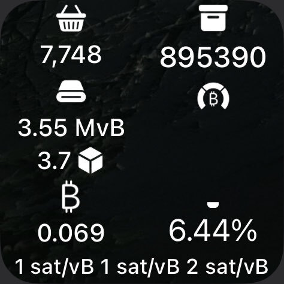

# scriptable-scripts

random scripts i decide to make with Scriptable
prolly just gonna be widgets

# LibFoxxo

buncha wrapper methods around common Scriptable tasks, such as creating a centered text stack, a progress bar, and checking if a file is in icloud, among other things.

# Foxpool

Bitcoin mempool viewer, using bitcoinexplorer.org or your own instance.

# BTCHalving

Bitcoin halving progress widget, using bitcoinexplorer.org or your own instance.

